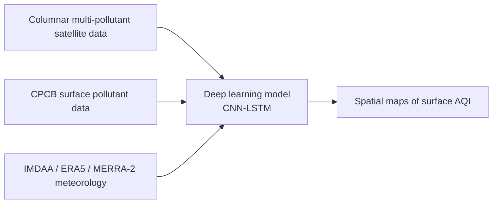
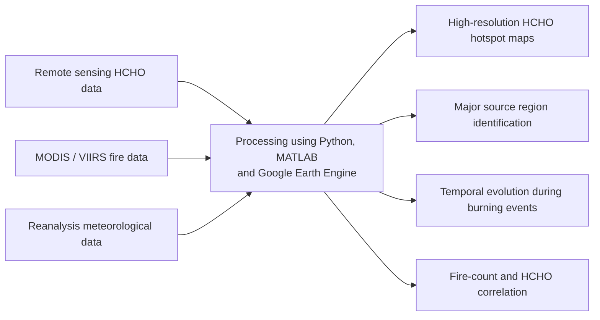

# Development of Surface AQI & Identification of HCHO Hotspots over India using Satellite Data

## Overview

Air pollution is a major health hazard associated with excess deaths worldwide. Air Quality Index (AQI) converts weighted values of individual pollutants such as CO, NO₂, O₃, SO₂, PM₂.₅ and related parameters into a single rating scale that can be used for public communication, decision-making and regulatory action. Because large populations live far from ground-based monitoring stations, satellite-derived surface AQI products are important for daily spatial assessment of air pollution exposure.

Formaldehyde (HCHO) is a key indicator of volatile organic compound (VOC) emissions and contributes to ozone formation and atmospheric chemistry. Biomass burning events, including agricultural residue burning and forest fires, release large amounts of VOCs and can enhance HCHO concentrations. Satellite sensors such as GOME, SCIAMACHY, OMI and TROPOMI enable monitoring of HCHO columns and support spatio-temporal hotspot detection.

This project focuses on developing satellite-based surface AQI maps over India and identifying HCHO hotspots, especially during biomass burning seasons. The work aligns with India's National Clean Air Programme (NCAP), Sustainable Development Goal target 11.6 and national priorities related to urban climate, air quality mitigation and sustainable development.

## Objectives

1. Develop surface AQI using satellite data and generate spatial AQI maps over India.
2. Produce high-resolution maps of HCHO hotspots during biomass burning seasons.
3. Identify major source regions such as the Indo-Gangetic Plain and forest fire zones.
4. Analyze the influence of fire activity and atmospheric transport on HCHO levels.

## Expected Outcomes

- Spatial maps of surface AQI over India.
- Spatial maps of HCHO concentrations and hotspots over India.
- Identification of major source regions contributing to enhanced pollution levels.
- Analysis of fire activity influence on HCHO enhancement and transport.

## Required Datasets

| Dataset | Purpose | Source |
| --- | --- | --- |
| INSAT-3D Aerosol Optical Depth (AOD) | Derive surface PM₂.₅ and AQI inputs | [MOSDAC INSAT-3D data products](https://www.mosdac.gov.in/insat-3d-data-products) |
| Sentinel-5P / TROPOMI NO₂, SO₂, CO, O₃ and HCHO | Columnar multi-pollutant and HCHO observations | [Google Earth Engine Sentinel-5P catalog](https://developers.google.com/earth-engine/datasets/catalog/sentinel-5p/), [DLR Sentinel-5P L3 files](https://download.geoservice.dlr.de/S5P_TROPOMI/files/L3/) |
| CPCB ground-based air quality observations | Surface pollutant measurements for training and validation | [CPCB CAAQM data repository](https://airquality.cpcb.gov.in/ccr/#/caaqm-dashboard-all/caaqm-landing/caaqm-data-repository) |
| MODIS / VIIRS active fire counts | Biomass burning period and source detection | [NASA FIRMS active fire data](https://firms.modaps.eosdis.nasa.gov/active_fire/) |
| ERA5 / IMDAA / MERRA-2 meteorology | Wind, transport and meteorological predictors | [ERA5 single levels](https://cds.climate.copernicus.eu/datasets/reanalysis-era5-single-levels?tab=download), [IMDAA](https://nwp.ncmrwf.gov.in/reanalysis), [MERRA-2](https://disc.gsfc.nasa.gov/datasets?project=MERRA-2) |

## Suggested Tools and Technologies

- Python for preprocessing, modeling, statistics and visualization.
- Google Earth Engine for satellite data access and large-scale geospatial processing.
- Deep learning frameworks for CNN, LSTM or CNN-LSTM model development.
- GIS and geospatial Python libraries such as xarray, rasterio, rioxarray, geopandas, cartopy and folium.

## Methodology

### Objective 1: Surface AQI Development

1. Generate a database of columnar multi-pollutant concentrations from satellite datasets.
2. Generate a database of CPCB surface pollutant measurements collocated with meteorological parameters from IMDAA, ERA5 or MERRA-2.
3. Develop a deep learning model, such as CNN-LSTM, to predict ground-level pollutant concentrations from satellite and meteorological predictors.
4. Validate predicted concentrations against ground-based observations.
5. Convert predicted pollutant concentrations into AQI categories and prepare daily spatial AQI maps over India.

#### Objective 1 Workflow



### Objective 2: HCHO Hotspot Identification

1. Acquire and preprocess satellite HCHO column data.
2. Extract biomass burning periods using MODIS / VIIRS fire count datasets.
3. Map the spatio-temporal distribution of HCHO concentrations over India.
4. Identify hotspots using statistical thresholds, anomaly detection or clustering methods.
5. Analyze correlation between fire counts and HCHO enhancement.
6. Assess transport influence using wind and reanalysis meteorological data.

#### Objective 2 Workflow



## Evaluation Parameters

### Objective 1

Model performance should be evaluated using statistical metrics such as:

- Root Mean Square Error (RMSE)
- Pearson correlation coefficient (R)
- Mean Absolute Error (MAE)
- Bias and spatial error diagnostics

### Objective 2

HCHO hotspot analysis should be evaluated using:

- Accuracy and clarity of hotspot detection.
- Integration quality of satellite, fire and meteorological datasets.
- Scientific interpretation of source regions and transport pathways.
- Visualization quality for spatial maps, temporal evolution and regional time series.
- Innovation in hotspot detection and attribution methodology.


## Implemented Starter Workflow

This repository now includes a Python starter package for the project:

- `surface_aqi_hcho.aqi` calculates Indian AQI sub-indices, overall AQI, AQI category and dominant pollutant from predicted or observed surface pollutant concentrations.
- `surface_aqi_hcho.hotspots` flags HCHO hotspots using seasonal grouped z-score and quantile thresholds and computes fire-count/HCHO correlation.
- `surface_aqi_hcho.metrics` computes RMSE, MAE, bias and Pearson correlation for validating satellite-derived surface pollutant predictions against CPCB observations.
- `configs/project_config.yaml` records the default India bounding box, biomass-burning seasons, source datasets, model targets and hotspot thresholds.

### Quick Start

```bash
python -m pip install -e .[dev]
pytest
surface-aqi-hcho aqi --json '{"PM2.5": 45, "PM10": 260, "NO2": 25}'
PYTHONPATH=src python scripts/run_demo_workflow.py
```

The starter code is intentionally modular so data ingestion scripts, Google Earth Engine exports, CNN-LSTM training code and map generation can be added without changing the AQI, hotspot and validation utility APIs.

## Development Roadmap

The repository now covers the core pieces needed to continue toward a complete solution:

1. **Data acquisition:** use the source links in `configs/project_config.yaml` and the Google Earth Engine template in `gee/` to export Sentinel-5P HCHO products over India.
2. **Quality control:** apply valid physical ranges from `surface_aqi_hcho.quality` before collocation and modeling.
3. **Collocation:** use `surface_aqi_hcho.collocation` to pair CPCB station observations with satellite and meteorological records by distance and time window.
4. **Model validation:** use `surface_aqi_hcho.metrics` to report RMSE, MAE, bias and Pearson R for predicted surface pollutants.
5. **AQI mapping:** pass predicted pollutant grids through `surface_aqi_hcho.aqi` to derive AQI category and dominant pollutant layers.
6. **HCHO hotspot attribution:** combine `surface_aqi_hcho.hotspots`, FIRMS fire counts and reanalysis winds to evaluate biomass-burning enhancement and transport.

## Proposed Repository Structure

```text
.
├── configs/               # Project configuration for spatial extent, datasets and thresholds
├── data/                  # Local or linked input datasets, excluded from version control when large
├── gee/                   # Google Earth Engine export templates
├── notebooks/             # Exploratory analysis and Google Earth Engine workflows
├── scripts/               # Runnable local workflow demonstrations
├── src/                   # Reusable preprocessing, modeling and visualization code
├── tests/                 # Unit tests for AQI, hotspot and metric utilities
├── outputs/               # Generated maps, figures and reports
├── models/                # Trained model artifacts and configuration files
└── README.md              # Project documentation
```

## Notes

Large satellite, fire and reanalysis datasets should not be committed directly to the repository. Store large files externally or use reproducible download scripts, metadata manifests and configuration files to document data provenance.
